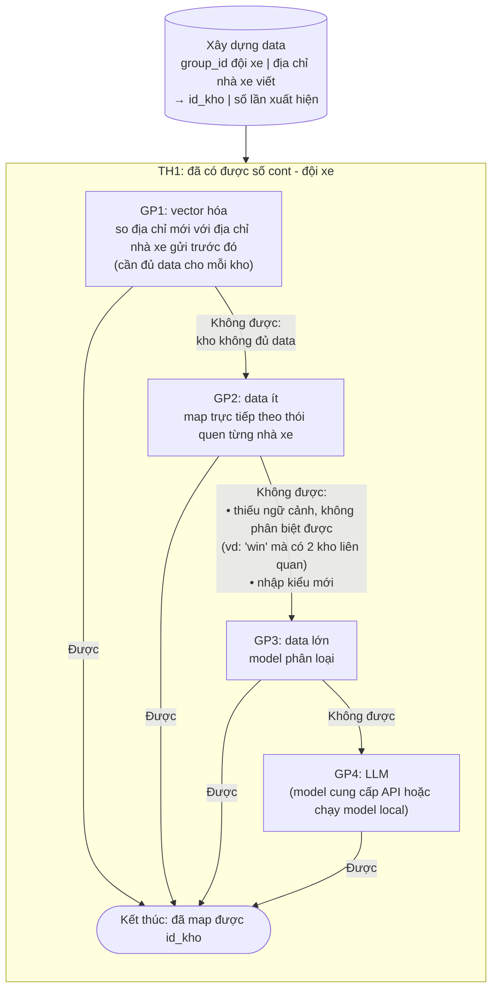

```mermaid
flowchart TD
    DATA[("Xây dựng data<br/>group_id đội xe | địa chỉ nhà xe viết<br/>→ id_kho | số lần xuất hiện")]

    DATA --> TH1

    subgraph TH1["TH1: đã có được số cont - đội xe"]
        direction TB
        GP1["GP1: vector hóa<br/>so địa chỉ mới với địa chỉ nhà xe gửi trước đó<br/>(cần đủ data cho mỗi kho)"]
        GP2["GP2: data ít<br/>map trực tiếp theo thói quen từng nhà xe"]
        GP3["GP3: data lớn<br/>model phân loại"]
        GP4["GP4: LLM<br/>(model cung cấp API hoặc chạy model local)"]
        END1(["Kết thúc: đã map được id_kho"])

        GP1 -- "Được" --> END1
        GP1 -- "Không được:<br/>kho không đủ data" --> GP2

        GP2 -- "Được" --> END1
        GP2 -- "Không được:<br/>• thiếu ngữ cảnh, không phân biệt được<br/>(vd: 'win' mà có 2 kho liên quan)<br/>• nhập kiểu mới" --> GP3

        GP3 -- "Được" --> END1
        GP3 -- "Không được" --> GP4

        GP4 -- "Được" --> END1
    end

```
