# I. Luồng tổng quát

## 1. Flow Diagram

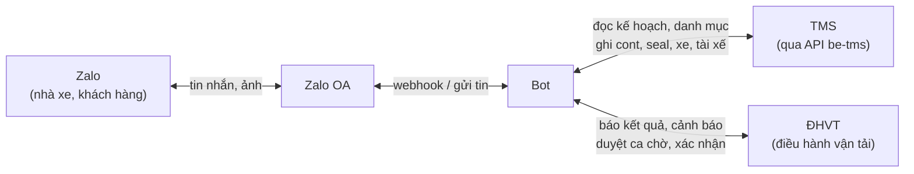
```mermaid
flowchart LR
    Zalo["Zalo<br/>(nhà xe, khách hàng)"]
    OA["Zalo OA"]
    Bot["Bot"]
    TMS["TMS<br/>(qua API be-tms)"]
    DHVT["ĐHVT<br/>(điều hành vận tải)"]

    Zalo <-->|"tin nhắn, ảnh"| OA
    OA <-->|"webhook / gửi tin"| Bot
    Bot <-->|"đọc kế hoạch, danh mục<br/>ghi cont, seal, xe, tài xế"| TMS
    Bot <-->|"báo kết quả, cảnh báo<br/>duyệt ca chờ, xác nhận"| DHVT
```

## 2. Sequence Diagram

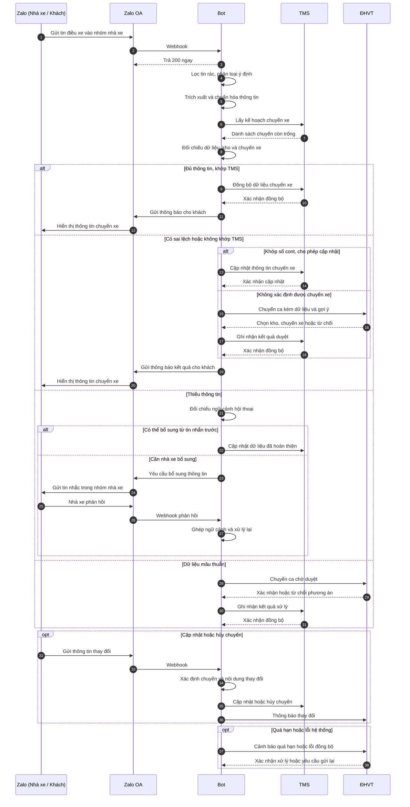
```mermaid
sequenceDiagram
    autonumber
    participant Z as Zalo (Nhà xe / Khách)
    participant OA as Zalo OA
    participant B as Bot
    participant T as TMS
    participant D as ĐHVT

    Z->>OA: Gửi tin điều xe vào nhóm nhà xe
    OA->>B: Webhook

    B-->>OA: Trả 200 ngay

    B->>B: Lọc tin rác, phân loại ý định
    B->>B: Trích xuất và chuẩn hóa thông tin

    B->>T: Lấy kế hoạch chuyến xe
    T-->>B: Danh sách chuyến còn trống
    B->>B: Đối chiếu dữ liệu, kho và chuyến xe

    alt Đủ thông tin, khớp TMS
        B->>T: Đồng bộ dữ liệu chuyến xe
        T-->>B: Xác nhận đồng bộ
        B->>OA: Gửi thông báo cho khách
        OA->>Z: Hiển thị thông tin chuyến xe

    else Có sai lệch hoặc không khớp TMS
        alt Khớp số cont, cho phép cập nhật
            B->>T: Cập nhật thông tin chuyến xe
            T-->>B: Xác nhận cập nhật
        else Không xác định được chuyến xe
            B->>D: Chuyển ca kèm dữ liệu và gợi ý
            D-->>B: Chọn kho, chuyến xe hoặc từ chối
            B->>T: Ghi nhận kết quả duyệt
            T-->>B: Xác nhận đồng bộ
        end
        B->>OA: Gửi thông báo kết quả cho khách
        OA->>Z: Hiển thị thông tin chuyến xe

    else Thiếu thông tin
        B->>B: Đối chiếu ngữ cảnh hội thoại
        alt Có thể bổ sung từ tin nhắn trước
            B->>T: Cập nhật dữ liệu đã hoàn thiện
        else Cần nhà xe bổ sung
            B->>OA: Yêu cầu bổ sung thông tin
            OA->>Z: Gửi tin nhắc trong nhóm nhà xe
            Z->>OA: Nhà xe phản hồi
            OA->>B: Webhook phản hồi
            B->>B: Ghép ngữ cảnh và xử lý lại
        end

    else Dữ liệu mâu thuẫn
        B->>D: Chuyển ca chờ duyệt
        D-->>B: Xác nhận hoặc từ chối phương án
        B->>T: Ghi nhận kết quả xử lý
        T-->>B: Xác nhận đồng bộ
    end

    opt Cập nhật hoặc hủy chuyến
        Z->>OA: Gửi thông tin thay đổi
        OA->>B: Webhook
        B->>B: Xác định chuyến và nội dung thay đổi
        B->>T: Cập nhật hoặc hủy chuyến
        B->>D: Thông báo thay đổi
    end

    opt Quá hạn hoặc lỗi hệ thống
        B->>D: Cảnh báo quá hạn hoặc lỗi đồng bộ
        D-->>B: Xác nhận xử lý hoặc yêu cầu gửi lại
    end
```

## 3. Logic xử lý tin nhắn

Xem chi tiết tại mục [II.1.1 Bot với nhà xe](#11-bot-với-nhà-xe).

# II. Chi tiết nghiệp vụ
## 1. Sơ đồ luồng (flowchart)
### 1.1 Bot với nhà xe

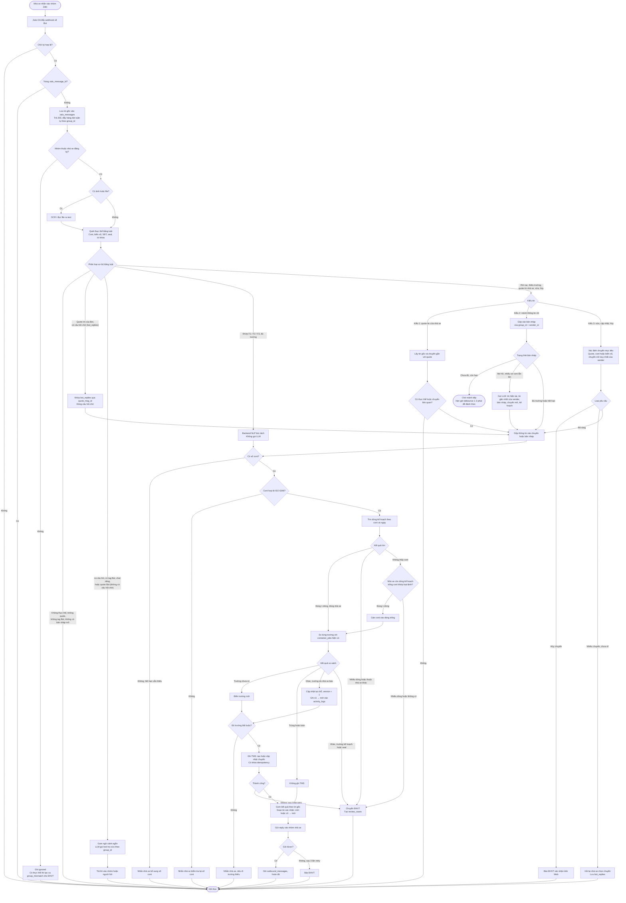
```mermaid
flowchart TD
    A(["Nhà xe nhắn vào nhóm Zalo"]) --> B["Zalo OA đẩy webhook về Bot"]
    B --> C{"Chữ ký hợp lệ?"}
    C -- "Không" --> Z(["Kết thúc"])
    C -- "Có" --> D{"Trùng zalo_message_id?"}
    D -- "Có" --> Z
    D -- "Không" --> E["Lưu tin gốc vào zalo_messages<br/>Trả 200, đẩy hàng đợi tuần tự theo group_id"]

    E --> F{"Nhóm thuộc nhà xe đăng ký?"}
    F -- "Không" --> F1["Ghi ignored<br/>Có thực thể thì tạo ca group_mismatch cho ĐHVT"] --> Z
    F -- "Có" --> IMG{"Có ảnh hoặc file?"}
    IMG -- "Có" --> OCR["OCR / đọc file ra text"] --> G
    IMG -- "Không" --> G["Quét thực thể bằng luật<br/>Cont, biển số, SĐT, seal, từ khóa"]

    G --> H{"Phân loại sơ bộ bằng luật"}
    H -- "Không thực thể, không quote,<br/>không tag Bot, không có bản nháp mở" --> Z
    H -- "Quote tin của Bot,<br/>có câu hỏi chờ (bot_replies)" --> R_BOT["Khớp bot_replies qua quote_msg_id<br/>Đóng câu hỏi chờ"] --> MERGE
    H -- "Là câu hỏi, có tag Bot, chat riêng,<br/>hoặc quote Bot (không có câu hỏi chờ)" --> Q1["Gom ngữ cảnh ngắn<br/>LLM gọi tool tra cứu theo group_id"]
    Q1 --> Q2["Trả lời vào nhóm hoặc người hỏi"] --> Z
    H -- "Khớp F1 / F2 / F3, đủ trường" --> P1["Backend NLP bóc tách<br/>Không gọi LLM"] --> V
    H -- "Rời rạc, thiếu trường,<br/>quote tin nhà xe, sửa, hủy" --> R0{"Kiểu tin"}

    R0 -- "Kiểu 1: quote tin của nhà xe" --> R1["Lấy tin gốc và chuyến gắn với quote"]
    R1 --> R1c{"Có thực thể hoặc chuyến liên quan?"}
    R1c -- "Không" --> Z
    R1c -- "Có" --> MERGE

    R0 -- "Kiểu 2: mảnh thông tin rời" --> R2["Gộp vào bản nháp<br/>của group_id + sender_id"]
    R2 --> R2c{"Trạng thái bản nháp"}
    R2c -- "Chưa đủ, còn hạn" --> W(["Chờ mảnh tiếp<br/>Hẹn giờ debounce 1-3 phút để đánh thức"])
    R2c -- "Mơ hồ, nhiều xe cont lẫn lộn" --> LLM["Gọi LLM: tin hiện tại, tin gần nhất của sender,<br/>bản nháp, chuyến mở, kế hoạch"] --> MERGE
    R2c -- "Đủ trường hoặc hết hạn" --> MERGE

    R0 -- "Kiểu 3: sửa, cập nhật, hủy" --> R3["Xác định chuyến mục tiêu<br/>Quote, cont hoặc biển số, chuyến mở duy nhất của sender"]
    R3 --> R3t{"Loại yêu cầu"}
    R3t -- "Hủy chuyến" --> CAN["Báo ĐHVT xác nhận trên Web"] --> Z
    R3t -- "Nhiều chuyến, chưa rõ" --> ASK1["Hỏi lại nhà xe chọn chuyến<br/>Lưu bot_replies"] --> Z
    R3t -- "Rõ ràng" --> MERGE

    MERGE["Gộp thông tin vào chuyến hoặc bản nháp"] --> V
    V{"Có số cont?"}
    V -- "Không, hết hạn vẫn thiếu" --> ASK2["Nhắn nhà xe bổ sung số cont"] --> Z
    V -- "Có" --> ISO{"Cont hợp lệ ISO 6346?"}
    ISO -- "Không" --> ASK3["Nhắn nhà xe kiểm tra lại số cont"] --> Z
    ISO -- "Có" --> I["Tìm dòng kế hoạch theo cont và ngày"]

    I --> J{"Kết quả tìm"}
    J -- "Đúng 1 dòng, đúng nhà xe" --> S
    J -- "Nhiều dòng hoặc thuộc nhà xe khác" --> DHVT["Chuyển ĐHVT<br/>Tạo review_cases"]
    J -- "Không thấy cont" --> J2{"Nhà xe còn dòng kế hoạch<br/>trống cont khớp loại lệnh?"}
    J2 -- "Đúng 1 dòng" --> GAN["Gán cont vào dòng trống"] --> S
    J2 -- "Nhiều dòng hoặc không có" --> DHVT
    DHVT --> Z

    S["So từng trường với container_jobs hiện có"] --> C1{"Kết quả so sánh"}
    C1 -- "Trường chưa có" --> FILL["Điền trường mới"] --> CHK
    C1 -- "Trùng hoàn toàn" --> NOOP["Không ghi TMS"] --> CF
    C1 -- "Khác, trường do nhà xe báo" --> UPD["Cập nhật tại chỗ, version + 1<br/>Ghi cũ → mới vào activity_logs"] --> CHK
    C1 -- "Khác, trường kế hoạch hoặc seal" --> DHVT

    CHK{"Đủ trường bắt buộc?"}
    CHK -- "Không" --> ASK4["Nhắn nhà xe, nêu rõ trường thiếu"] --> Z
    CHK -- "Có" --> WT["Ghi TMS: tạo hoặc cập nhật chuyến<br/>Có khóa idempotency"]
    WT --> OK{"Thành công?"}
    OK -- "Không, sau 3 lần retry" --> DHVT
    OK -- "Có" --> CF["Gom kết quả theo tin gốc<br/>Soạn tin xác nhận: mới hoặc cũ → mới"]
    CF --> SEND["Gửi reply vào nhóm nhà xe"]
    SEND --> SOK{"Gửi được?"}
    SOK -- "Có" --> LOG["Ghi outbound_messages, hoàn tất"] --> Z
    SOK -- "Không, sau 3 lần retry" --> DHVT2["Báo ĐHVT"] --> Z
```

### 1.2 Bot với khách hàng
#### 1.2a Bot gửi thông tin chuyến cho khách hàng

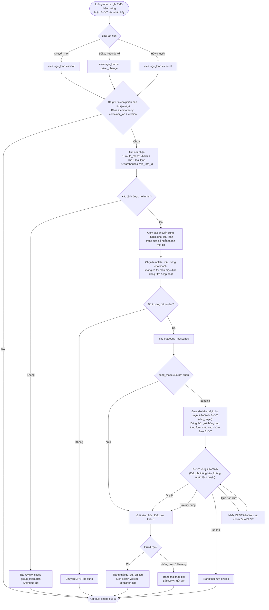
```mermaid
flowchart TD
    T1(["Luồng nhà xe: ghi TMS thành công<br/>hoặc ĐHVT xác nhận hủy"]) --> T2{"Loại sự kiện"}
    T2 -- "Chuyến mới" --> K1["message_kind = initial"]
    T2 -- "Đổi xe hoặc tài xế" --> K2["message_kind = driver_change"]
    T2 -- "Hủy chuyến" --> K3["message_kind = cancel"]
    K1 --> D
    K2 --> D
    K3 --> D

    D{"Đã gửi tin cho phiên bản dữ liệu này?<br/>Khóa idempotency: container_job + version"}
    D -- "Rồi" --> Z(["Kết thúc, không gửi lại"])
    D -- "Chưa" --> R["Tìm nơi nhận<br/>1. route_maps: khách + kho + loại lệnh<br/>2. warehouses.zalo_info_id"]

    R --> R2{"Xác định được nơi nhận?"}
    R2 -- "Không" --> RV["Tạo review_cases group_mismatch<br/>Không tự gửi"] --> Z
    R2 -- "Có" --> G["Gom các chuyến cùng khách, kho, loại lệnh<br/>trong cửa sổ ngắn thành một tin"]

    G --> TP["Chọn template: mẫu riêng của khách,<br/>không có thì mẫu mặc định dong / tra / cập nhật"]
    TP --> TP2{"Đủ trường để render?"}
    TP2 -- "Không" --> RV2["Chuyển ĐHVT bổ sung"] --> Z
    TP2 -- "Có" --> OB["Tạo outbound_messages"]

    OB --> SM{"send_mode của nơi nhận"}
    SM -- "auto" --> SEND
    SM -- "pending" --> DR["Đưa vào hàng đợi chờ duyệt trên Web ĐHVT (cho_duyet)<br/>Đồng thời gửi thông báo theo form mẫu vào nhóm Zalo ĐHVT"]
    DR --> AP{"ĐHVT xử lý trên Web<br/>(Zalo chỉ thông báo, không nhận lệnh duyệt)"}
    AP -- "Duyệt" --> SEND
    AP -- "Sửa nội dung" --> SEND
    AP -- "Từ chối" --> CX["Trạng thái huy, ghi log"] --> Z
    AP -- "Quá hạn chờ" --> RM["Nhắc ĐHVT trên Web và nhóm Zalo ĐHVT"] --> AP

    SEND["Gửi vào nhóm Zalo của khách"] --> S1{"Gửi được?"}
    S1 -- "Có" --> LOG["Trạng thái da_gui, ghi log<br/>Liên kết tin với các container_job"] --> Z
    S1 -- "Không, sau 3 lần retry" --> MAN["Trạng thái that_bai<br/>Báo ĐHVT gửi tay"] --> Z
```

#### 1.2b Khách hỏi, bot trả lời
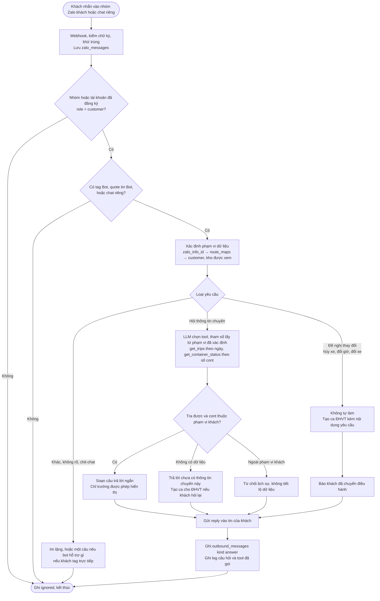
```mermaid
flowchart TD
    A(["Khách nhắn vào nhóm Zalo khách hoặc chat riêng"]) --> B["Webhook, kiểm chữ ký, khử trùng<br/>Lưu zalo_messages"]
    B --> C{"Nhóm hoặc tài khoản đã đăng ký<br/>role = customer?"}
    C -- "Không" --> Z(["Ghi ignored, kết thúc"])
    C -- "Có" --> D{"Có tag Bot, quote tin Bot,<br/>hoặc chat riêng?"}
    D -- "Không" --> Z

    D -- "Có" --> E["Xác định phạm vi dữ liệu<br/>zalo_info_id → route_maps → customer, kho được xem"]
    E --> F{"Loại yêu cầu"}

    F -- "Hỏi thông tin chuyến" --> Q["LLM chọn tool, tham số lấy từ phạm vi đã xác định<br/>get_trips theo ngày, get_container_status theo số cont"]
    Q --> Q2{"Tra được và cont thuộc phạm vi khách?"}
    Q2 -- "Có" --> ANS["Soạn câu trả lời ngắn<br/>Chỉ trường được phép hiển thị"]
    Q2 -- "Không có dữ liệu" --> NF["Trả lời chưa có thông tin chuyến này<br/>Tạo ca cho ĐHVT nếu khách hỏi lại"]
    Q2 -- "Ngoài phạm vi khách" --> DENY["Từ chối lịch sự, không tiết lộ dữ liệu"]

    F -- "Đề nghị thay đổi<br/>hủy xe, đổi giờ, đổi xe" --> CH["Không tự làm<br/>Tạo ca ĐHVT kèm nội dung yêu cầu"]
    CH --> ACK["Báo khách đã chuyển điều hành"]

    F -- "Khác, không rõ, chit-chat" --> UN["Im lặng, hoặc một câu nêu bot hỗ trợ gì<br/>nếu khách tag trực tiếp"]

    ANS --> SEND["Gửi reply vào tin của khách"]
    NF --> SEND
    DENY --> SEND
    ACK --> SEND
    UN --> Z
    SEND --> LOG["Ghi outbound_messages kind answer<br/>Ghi log câu hỏi và tool đã gọi"] --> Z

```

### 1.3 Bot với ĐHVT

#### 1.3a Thông báo nhóm Zalo ĐHVT và ĐHVT xử lý trên Web

Khi có bất kỳ ca cần duyệt, tin chờ duyệt hoặc cảnh báo nào gửi đến hệ thống Web ĐHVT, Bot **đồng thời gửi thông tin vào nhóm Zalo của ĐHVT theo các form mẫu chuẩn** (kèm liên kết sang Web). Nhóm Zalo ĐHVT chỉ dùng để thông báo, **không phụ trách duyệt thông tin và Bot không nhận lệnh duyệt/sửa/hủy từ nhóm này**.

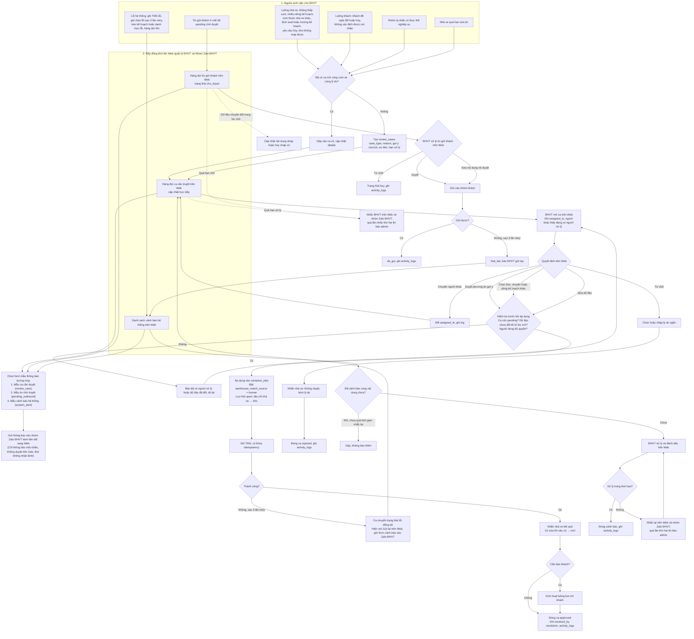
```mermaid
flowchart TD
    subgraph SRC["1. Nguồn sinh việc cho ĐHVT"]
        S1["Luồng nhà xe: không thấy cont, nhiều dòng kế hoạch,<br/>cont thuộc nhà xe khác, lệch seal hoặc trường kế hoạch,<br/>yêu cầu hủy, kho không map được"]
        S2["Luồng khách: khách đề nghị đổi hoặc hủy,<br/>không xác định được nơi nhận"]
        S3["Nhóm lạ nhắn có thực thể nghiệp vụ"]
        S4["Tin gửi khách ở chế độ pending chờ duyệt"]
        S5["Lỗi hệ thống: ghi TMS lỗi, gửi Zalo lỗi sau 3 lần retry,<br/>kéo kế hoạch hoặc danh mục lỗi, hàng đợi tồn"]
        S6["Nhà xe quá hạn sửa tin"]
    end

    S1 --> C0
    S2 --> C0
    S3 --> C0
    S6 --> C0
    S4 --> OBQ
    S5 --> AL

    C0{"Đã có ca mở cùng cont và cùng lý do?"}
    C0 -- "Có" --> C1["Gộp vào ca cũ, cập nhật details"]
    C0 -- "Không" --> C2["Tạo review_cases<br/>case_type, reason, gợi ý của bot, ưu tiên, hạn xử lý"]
    C1 --> Q
    C2 --> Q

    subgraph WEB["2. Đẩy đồng thời lên Web quản lý ĐHVT và Nhóm Zalo ĐHVT"]
        Q["Hàng đợi ca cần duyệt trên Web<br/>cập nhật trực tiếp"]
        OBQ["Hàng đợi tin gửi khách trên Web<br/>trạng thái cho_duyet"]
        AL["Danh sách cảnh báo hệ thống trên Web"]
    end

    Q --> ZN_FORM["Chọn form mẫu thông báo tương ứng:<br/>1. Mẫu ca cần duyệt (review_case)<br/>2. Mẫu tin chờ duyệt (pending_outbound)<br/>3. Mẫu cảnh báo hệ thống (system_alert)"]
    OBQ --> ZN_FORM
    AL --> ZN_FORM
    ZN_FORM --> ZN["Gửi thông báo vào nhóm Zalo ĐHVT kèm liên kết sang Web<br/>(Chỉ thông báo một chiều, không duyệt trên Zalo, Bot không nhận lệnh)"]

    Q --> O["ĐHVT mở ca trên Web<br/>Ghi assigned_to, người khác thấy đang có người xử lý"]
    O --> D{"Quyết định trên Web"}
    D -- "Duyệt phương án gợi ý" --> V
    D -- "Chọn kho, chuyến hoặc dòng kế hoạch khác" --> V
    D -- "Sửa dữ liệu" --> V
    D -- "Chuyển người khác" --> TR["Đổi assigned_to, ghi log"] --> Q
    D -- "Từ chối" --> RJ["Chọn hoặc nhập lý do ngắn"]

    V{"Kiểm tra trước khi áp dụng<br/>Ca còn pending? Dữ liệu chưa đổi kể từ lúc mở?<br/>Người dùng đủ quyền?"}
    V -- "Không" --> STALE["Báo đã có người xử lý hoặc dữ liệu đã đổi, tải lại"] --> O
    V -- "Có" --> AP["Áp dụng vào container_jobs<br/>Đặt warehouse_match_source = human<br/>Lưu thói quen: địa chỉ nhà xe → kho"]

    AP --> TMS["Ghi TMS, có khóa idempotency"]
    TMS --> T{"Thành công?"}
    T -- "Không, sau 3 lần retry" --> TF["Ca chuyển trạng thái lỗi đồng bộ<br/>Hiện nút Gửi lại trên Web, gửi form cảnh báo vào Zalo ĐHVT"] --> Q
    T -- "Có" --> N1["Nhắn nhà xe kết quả<br/>Có sửa thì nêu cũ → mới"]
    N1 --> N2{"Cần báo khách?"}
    N2 -- "Có" --> N3["Kích hoạt luồng bot với khách"]
    N2 -- "Không" --> CL
    N3 --> CL["Đóng ca approved<br/>Ghi resolved_by, resolution, activity_logs"]

    RJ --> RJ2["Nhắn nhà xe: không duyệt, kèm lý do"]
    RJ2 --> RJ3["Đóng ca rejected, ghi activity_logs"]

    OBQ --> OB1{"ĐHVT xử lý tin gửi khách trên Web"}
    OB1 -- "Duyệt" --> OBS
    OB1 -- "Sửa nội dung rồi duyệt" --> OBS
    OB1 -- "Từ chối" --> OBX["Trạng thái huy, ghi activity_logs"]
    OBS["Gửi vào nhóm khách"] --> OBK{"Gửi được?"}
    OBK -- "Có" --> OBL["da_gui, ghi activity_logs"]
    OBK -- "Không, sau 3 lần retry" --> OBF["that_bai, báo ĐHVT gửi tay"] --> AL
    OBQ -. "Dữ liệu chuyến đổi trong lúc chờ" .-> OBU["Cập nhật nội dung nháp hoặc hủy nháp cũ"]

    AL --> ALG{"Đã cảnh báo cùng nội dung chưa?"}
    ALG -- "Rồi, chưa quá thời gian nhắc lại" --> ALX["Gộp, không báo thêm"]
    ALG -- "Chưa" --> ALW["ĐHVT xử lý và đánh dấu trên Web"]
    ALW --> ALD{"Xử lý trong thời hạn?"}
    ALD -- "Có" --> ALC["Đóng cảnh báo, ghi activity_logs"]
    ALD -- "Không" --> ALR["Nhắc lại trên Web và nhóm Zalo ĐHVT,<br/>quá lần thứ hai thì báo admin"] --> ALW

    Q -. "Quá hạn xử lý" .-> ESC["Nhắc ĐHVT trên Web và nhóm Zalo ĐHVT,<br/>quá lần nhắc thứ hai thì báo admin"]
    OBQ -. "Quá hạn chờ" .-> ESC
```

#### 1.3b ĐHVT hỏi, Bot trả lời (Tra cứu nội bộ)

Trong nhóm Zalo ĐHVT hoặc chat riêng, ĐHVT có thể tag/quote Bot để hỏi tra cứu thông tin toàn hệ thống (chuyến xe, kế hoạch, nhà xe, khách hàng, các ca đang chờ duyệt). Tuy nhiên, nếu ĐHVT nhắn lệnh duyệt/sửa/hủy trên Zalo, Bot sẽ từ chối thực thi trên Zalo và gửi liên kết để ĐHVT thao tác trên Web.

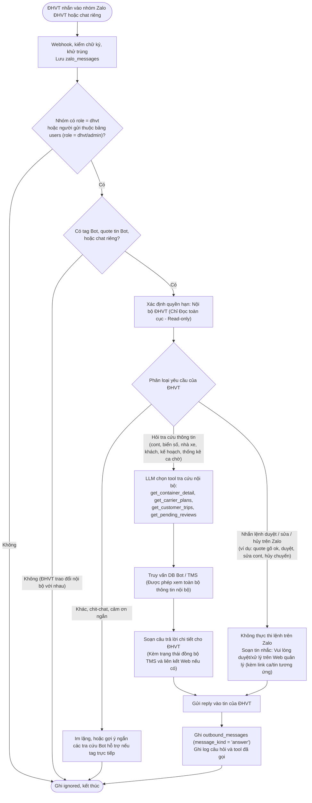
```mermaid
flowchart TD
    A(["ĐHVT nhắn vào nhóm Zalo ĐHVT hoặc chat riêng"]) --> B["Webhook, kiểm chữ ký, khử trùng<br/>Lưu zalo_messages"]
    B --> C{"Nhóm có role = dhvt<br/>hoặc người gửi thuộc bảng users (role = dhvt/admin)?"}
    C -- "Không" --> Z(["Ghi ignored, kết thúc"])
    C -- "Có" --> D{"Có tag Bot, quote tin Bot,<br/>hoặc chat riêng?"}
    D -- "Không (ĐHVT trao đổi nội bộ với nhau)" --> Z

    D -- "Có" --> E["Xác định quyền hạn: Nội bộ ĐHVT (Chỉ Đọc toàn cục - Read-only)"]
    E --> F{"Phân loại yêu cầu của ĐHVT"}

    F -- "Hỏi tra cứu thông tin<br/>(cont, biển số, nhà xe, khách, kế hoạch, thống kê ca chờ)" --> Q["LLM chọn tool tra cứu nội bộ:<br/>get_container_detail, get_carrier_plans,<br/>get_customer_trips, get_pending_reviews"]
    Q --> Q2["Truy vấn DB Bot / TMS (Được phép xem toàn bộ thông tin nội bộ)"]
    Q2 --> ANS["Soạn câu trả lời chi tiết cho ĐHVT<br/>(Kèm trạng thái đồng bộ TMS và liên kết Web nếu có)"]

    F -- "Nhắn lệnh duyệt / sửa / hủy trên Zalo<br/>(ví dụ: quote gõ ok, duyệt, sửa cont, hủy chuyến)" --> CMD_REJECT["Không thực thi lệnh trên Zalo<br/>Soạn tin nhắc: Vui lòng duyệt/xử lý trên Web quản lý (kèm link ca/tin tương ứng)"]

    F -- "Khác, chit-chat, cảm ơn ngắn" --> UN["Im lặng, hoặc gợi ý ngắn các tra cứu Bot hỗ trợ nếu tag trực tiếp"]

    ANS --> SEND["Gửi reply vào tin của ĐHVT"]
    CMD_REJECT --> SEND
    UN --> Z
    SEND --> LOG["Ghi outbound_messages (message_kind = 'answer')<br/>Ghi log câu hỏi và tool đã gọi"] --> Z
```

## 2. Sơ đồ tuần tự (sequence)

### 2.1 Bot với nhà xe

#### 2.1a Tiếp nhận và phân loại

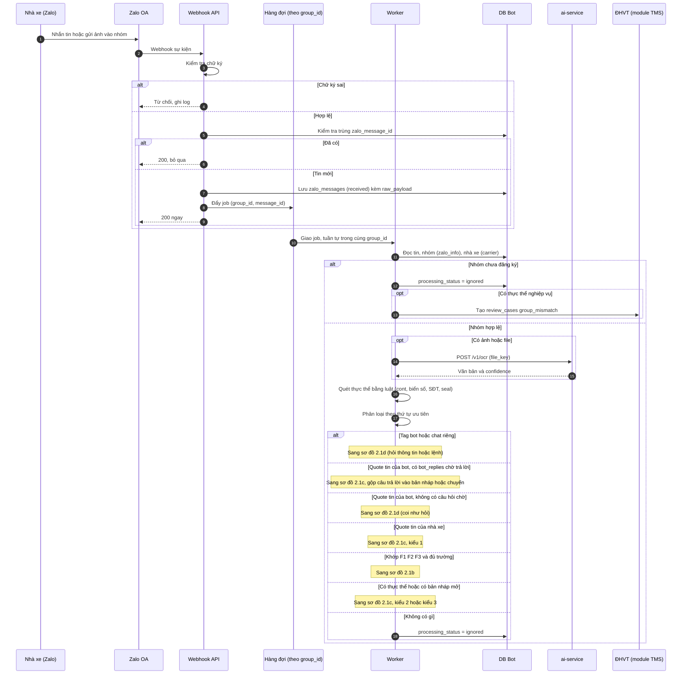
```mermaid
sequenceDiagram
    autonumber
    participant NX as Nhà xe (Zalo)
    participant OA as Zalo OA
    participant WH as Webhook API
    participant Q as Hàng đợi (theo group_id)
    participant W as Worker
    participant DB as DB Bot
    participant AI as ai-service
    participant DH as ĐHVT (module TMS)

    NX->>OA: Nhắn tin hoặc gửi ảnh vào nhóm
    OA->>WH: Webhook sự kiện
    WH->>WH: Kiểm tra chữ ký
    alt Chữ ký sai
        WH-->>OA: Từ chối, ghi log
    else Hợp lệ
        WH->>DB: Kiểm tra trùng zalo_message_id
        alt Đã có
            WH-->>OA: 200, bỏ qua
        else Tin mới
            WH->>DB: Lưu zalo_messages (received) kèm raw_payload
            WH->>Q: Đẩy job (group_id, message_id)
            WH-->>OA: 200 ngay
        end
    end

    Q->>W: Giao job, tuần tự trong cùng group_id
    W->>DB: Đọc tin, nhóm (zalo_info), nhà xe (carrier)
    alt Nhóm chưa đăng ký
        W->>DB: processing_status = ignored
        opt Có thực thể nghiệp vụ
            W->>DH: Tạo review_cases group_mismatch
        end
    else Nhóm hợp lệ
        opt Có ảnh hoặc file
            W->>AI: POST /v1/ocr (file_key)
            AI-->>W: Văn bản và confidence
        end
        W->>W: Quét thực thể bằng luật (cont, biển số, SĐT, seal)
        W->>W: Phân loại theo thứ tự ưu tiên
        alt Tag bot hoặc chat riêng
            Note over W: Sang sơ đồ 2.1d (hỏi thông tin hoặc lệnh)
        else Quote tin của bot, có bot_replies chờ trả lời
            Note over W: Sang sơ đồ 2.1c, gộp câu trả lời vào bản nháp hoặc chuyến
        else Quote tin của bot, không có câu hỏi chờ
            Note over W: Sang sơ đồ 2.1d (coi như hỏi)
        else Quote tin của nhà xe
            Note over W: Sang sơ đồ 2.1c, kiểu 1
        else Khớp F1 F2 F3 và đủ trường
            Note over W: Sang sơ đồ 2.1b
        else Có thực thể hoặc có bản nháp mở
            Note over W: Sang sơ đồ 2.1c, kiểu 2 hoặc kiểu 3
        else Không có gì
            W->>DB: processing_status = ignored
        end
    end
```

#### 2.1b Tin đủ trường: đối chiếu, ghi TMS, xác nhận

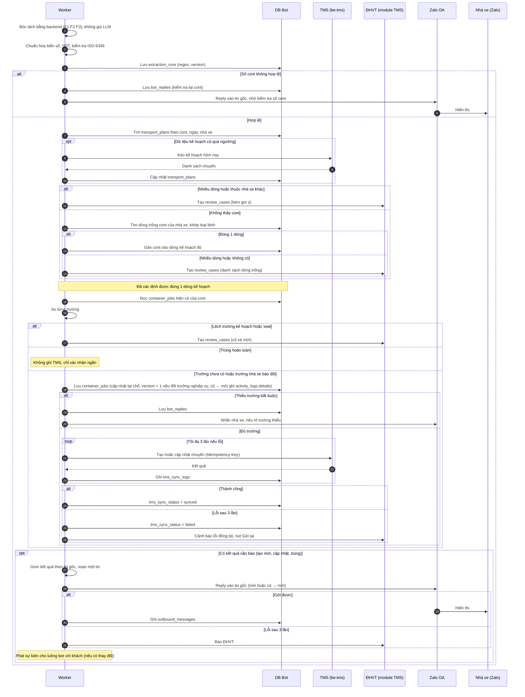
```mermaid
sequenceDiagram
    autonumber
    participant W as Worker
    participant DB as DB Bot
    participant TMS as TMS (be-tms)
    participant DH as ĐHVT (module TMS)
    participant OA as Zalo OA
    participant NX as Nhà xe (Zalo)

    W->>W: Bóc tách bằng backend (F1 F2 F3), không gọi LLM
    W->>W: Chuẩn hóa biển số, SĐT, kiểm tra ISO 6346
    W->>DB: Lưu extraction_runs (regex, version)

    alt Số cont không hợp lệ
        W->>DB: Lưu bot_replies (kiểm tra lại cont)
        W->>OA: Reply vào tin gốc, nhờ kiểm tra số cont
        OA->>NX: Hiển thị
    else Hợp lệ
        W->>DB: Tìm transport_plans theo cont, ngày, nhà xe
        opt Dữ liệu kế hoạch cũ quá ngưỡng
            W->>TMS: Kéo kế hoạch hôm nay
            TMS-->>W: Danh sách chuyến
            W->>DB: Cập nhật transport_plans
        end

        alt Nhiều dòng hoặc thuộc nhà xe khác
            W->>DH: Tạo review_cases (kèm gợi ý)
        else Không thấy cont
            W->>DB: Tìm dòng trống cont của nhà xe, khớp loại lệnh
            alt Đúng 1 dòng
                W->>DB: Gán cont vào dòng kế hoạch đó
            else Nhiều dòng hoặc không có
                W->>DH: Tạo review_cases (danh sách dòng trống)
            end
        end

        Note over W,DB: Đã xác định được đúng 1 dòng kế hoạch
        W->>DB: Đọc container_jobs hiện có của cont
        W->>W: So từng trường
        alt Lệch trường kế hoạch hoặc seal
            W->>DH: Tạo review_cases (cũ và mới)
        else Trùng hoàn toàn
            Note over W: Không ghi TMS, chỉ xác nhận ngắn
        else Trường chưa có hoặc trường nhà xe báo đổi
            W->>DB: Lưu container_jobs (cập nhật tại chỗ, version + 1 nếu đổi trường nghiệp vụ, cũ → mới ghi activity_logs.details)
            alt Thiếu trường bắt buộc
                W->>DB: Lưu bot_replies
                W->>OA: Nhắn nhà xe, nêu rõ trường thiếu
            else Đủ trường
                loop Tối đa 3 lần nếu lỗi
                    W->>TMS: Tạo hoặc cập nhật chuyến (Idempotency-Key)
                    TMS-->>W: Kết quả
                    W->>DB: Ghi tms_sync_logs
                end
                alt Thành công
                    W->>DB: tms_sync_status = synced
                else Lỗi sau 3 lần
                    W->>DB: tms_sync_status = failed
                    W->>DH: Cảnh báo lỗi đồng bộ, nút Gửi lại
                end
            end
        end

        opt Có kết quả cần báo (tạo mới, cập nhật, trùng)
            W->>W: Gom kết quả theo tin gốc, soạn một tin
            W->>OA: Reply vào tin gốc (mới hoặc cũ → mới)
            alt Gửi được
                OA->>NX: Hiển thị
                W->>DB: Ghi outbound_messages
            else Lỗi sau 3 lần
                W->>DH: Báo ĐHVT
            end
            Note over W: Phát sự kiện cho luồng bot với khách (nếu có thay đổi)
        end
    end
```

#### 2.1c Tin rời rạc: quote, bản nháp, hẹn giờ

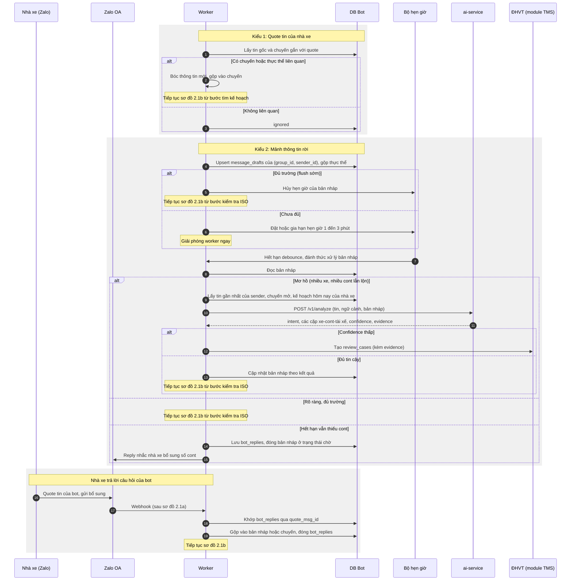
```mermaid
sequenceDiagram
    autonumber
    participant NX as Nhà xe (Zalo)
    participant OA as Zalo OA
    participant W as Worker
    participant DB as DB Bot
    participant T as Bộ hẹn giờ
    participant AI as ai-service
    participant DH as ĐHVT (module TMS)

    rect rgb(240, 240, 240)
    Note over W,DB: Kiểu 1: Quote tin của nhà xe
    W->>DB: Lấy tin gốc và chuyến gắn với quote
    alt Có chuyến hoặc thực thể liên quan
        W->>W: Bóc thông tin mới, gộp vào chuyến
        Note over W: Tiếp tục sơ đồ 2.1b từ bước tìm kế hoạch
    else Không liên quan
        W->>DB: ignored
    end
    end

    rect rgb(240, 240, 240)
    Note over W,DB: Kiểu 2: Mảnh thông tin rời
    W->>DB: Upsert message_drafts của (group_id, sender_id), gộp thực thể
    alt Đủ trường (flush sớm)
        W->>T: Hủy hẹn giờ của bản nháp
        Note over W: Tiếp tục sơ đồ 2.1b từ bước kiểm tra ISO
    else Chưa đủ
        W->>T: Đặt hoặc gia hạn hẹn giờ 1 đến 3 phút
        Note over W: Giải phóng worker ngay
    end

    T->>W: Hết hạn debounce, đánh thức xử lý bản nháp
    W->>DB: Đọc bản nháp
    alt Mơ hồ (nhiều xe, nhiều cont lẫn lộn)
        W->>DB: Lấy tin gần nhất của sender, chuyến mở, kế hoạch hôm nay của nhà xe
        W->>AI: POST /v1/analyze (tin, ngữ cảnh, bản nháp)
        AI-->>W: intent, các cặp xe-cont-tài xế, confidence, evidence
        alt Confidence thấp
            W->>DH: Tạo review_cases (kèm evidence)
        else Đủ tin cậy
            W->>DB: Cập nhật bản nháp theo kết quả
            Note over W: Tiếp tục sơ đồ 2.1b từ bước kiểm tra ISO
        end
    else Rõ ràng, đủ trường
        Note over W: Tiếp tục sơ đồ 2.1b từ bước kiểm tra ISO
    else Hết hạn vẫn thiếu cont
        W->>DB: Lưu bot_replies, đóng bản nháp ở trạng thái chờ
        W->>OA: Reply nhắc nhà xe bổ sung số cont
    end
    end

    rect rgb(240, 240, 240)
    Note over NX,W: Nhà xe trả lời câu hỏi của bot
    NX->>OA: Quote tin của bot, gửi bổ sung
    OA->>W: Webhook (sau sơ đồ 2.1a)
    W->>DB: Khớp bot_replies qua quote_msg_id
    W->>DB: Gộp vào bản nháp hoặc chuyến, đóng bot_replies
    Note over W: Tiếp tục sơ đồ 2.1b
    end
```

#### 2.1d Sửa hoặc hủy, và hỏi thông tin

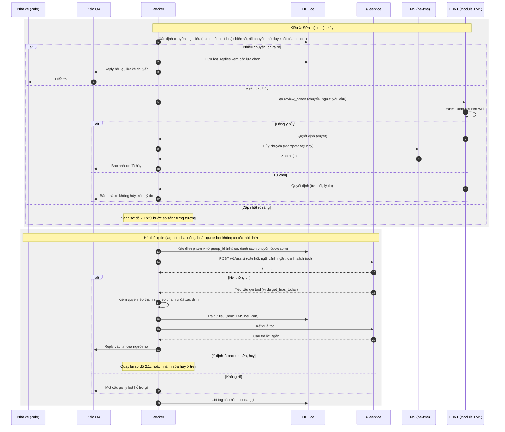
```mermaid
sequenceDiagram
    autonumber
    participant NX as Nhà xe (Zalo)
    participant OA as Zalo OA
    participant W as Worker
    participant DB as DB Bot
    participant AI as ai-service
    participant TMS as TMS (be-tms)
    participant DH as ĐHVT (module TMS)

    rect rgb(240, 240, 240)
    Note over W,DH: Kiểu 3: Sửa, cập nhật, hủy
    W->>DB: Xác định chuyến mục tiêu (quote, rồi cont hoặc biển số, rồi chuyến mở duy nhất của sender)
    alt Nhiều chuyến, chưa rõ
        W->>DB: Lưu bot_replies kèm các lựa chọn
        W->>OA: Reply hỏi lại, liệt kê chuyến
        OA->>NX: Hiển thị
    else Là yêu cầu hủy
        W->>DH: Tạo review_cases (chuyến, người yêu cầu)
        DH->>DH: ĐHVT xem xét trên Web
        alt Đồng ý hủy
            DH->>W: Quyết định (duyệt)
            W->>TMS: Hủy chuyến (Idempotency-Key)
            TMS-->>W: Xác nhận
            W->>OA: Báo nhà xe đã hủy
        else Từ chối
            DH->>W: Quyết định (từ chối, lý do)
            W->>OA: Báo nhà xe không hủy, kèm lý do
        end
    else Cập nhật rõ ràng
        Note over W: Sang sơ đồ 2.1b từ bước so sánh từng trường
    end
    end

    rect rgb(240, 240, 240)
    Note over NX,AI: Hỏi thông tin (tag bot, chat riêng, hoặc quote bot không có câu hỏi chờ)
    W->>DB: Xác định phạm vi từ group_id (nhà xe, danh sách chuyến được xem)
    W->>AI: POST /v1/assist (câu hỏi, ngữ cảnh ngắn, danh sách tool)
    AI-->>W: Ý định
    alt Hỏi thông tin
        AI-->>W: Yêu cầu gọi tool (ví dụ get_trips_today)
        W->>W: Kiểm quyền, ép tham số theo phạm vi đã xác định
        W->>DB: Tra dữ liệu (hoặc TMS nếu cần)
        W->>AI: Kết quả tool
        AI-->>W: Câu trả lời ngắn
        W->>OA: Reply vào tin của người hỏi
    else Ý định là báo xe, sửa, hủy
        Note over W: Quay lại sơ đồ 2.1c hoặc nhánh sửa hủy ở trên
    else Không rõ
        W->>OA: Một câu gợi ý bot hỗ trợ gì
    end
    W->>DB: Ghi log câu hỏi, tool đã gọi
    end
```

### 2.2 Bot với khách hàng

#### 2.2a Bot gửi thông tin chuyến cho khách

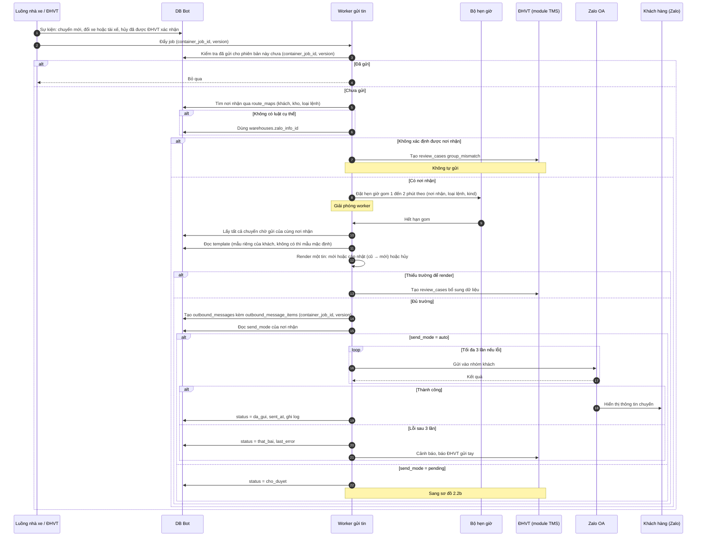
```mermaid
sequenceDiagram
    autonumber
    participant EV as Luồng nhà xe / ĐHVT
    participant DB as DB Bot
    participant W as Worker gửi tin
    participant T as Bộ hẹn giờ
    participant DH as ĐHVT (module TMS)
    participant OA as Zalo OA
    participant KH as Khách hàng (Zalo)

    EV->>DB: Sự kiện: chuyến mới, đổi xe hoặc tài xế, hủy đã được ĐHVT xác nhận
    EV->>W: Đẩy job (container_job_id, version)
    W->>DB: Kiểm tra đã gửi cho phiên bản này chưa (container_job_id, version)
    alt Đã gửi
        W-->>EV: Bỏ qua
    else Chưa gửi
        W->>DB: Tìm nơi nhận qua route_maps (khách, kho, loại lệnh)
        alt Không có luật cụ thể
            W->>DB: Dùng warehouses.zalo_info_id
        end
        alt Không xác định được nơi nhận
            W->>DH: Tạo review_cases group_mismatch
            Note over W,DH: Không tự gửi
        else Có nơi nhận
            W->>T: Đặt hẹn giờ gom 1 đến 2 phút theo (nơi nhận, loại lệnh, kind)
            Note over W: Giải phóng worker
            T->>W: Hết hạn gom
            W->>DB: Lấy tất cả chuyến chờ gửi của cùng nơi nhận
            W->>DB: Đọc template (mẫu riêng của khách, không có thì mẫu mặc định)
            W->>W: Render một tin: mới hoặc cập nhật (cũ → mới) hoặc hủy
            alt Thiếu trường để render
                W->>DH: Tạo review_cases bổ sung dữ liệu
            else Đủ trường
                W->>DB: Tạo outbound_messages kèm outbound_message_items (container_job_id, version)
                W->>DB: Đọc send_mode của nơi nhận
                alt send_mode = auto
                    loop Tối đa 3 lần nếu lỗi
                        W->>OA: Gửi vào nhóm khách
                        OA-->>W: Kết quả
                    end
                    alt Thành công
                        OA->>KH: Hiển thị thông tin chuyến
                        W->>DB: status = da_gui, sent_at, ghi log
                    else Lỗi sau 3 lần
                        W->>DB: status = that_bai, last_error
                        W->>DH: Cảnh báo, báo ĐHVT gửi tay
                    end
                else send_mode = pending
                    W->>DB: status = cho_duyet
                    Note over W,DH: Sang sơ đồ 2.2b
                end
            end
        end
    end
```

#### 2.2b Chế độ chờ duyệt trên Web (kèm thông báo sang nhóm Zalo ĐHVT)

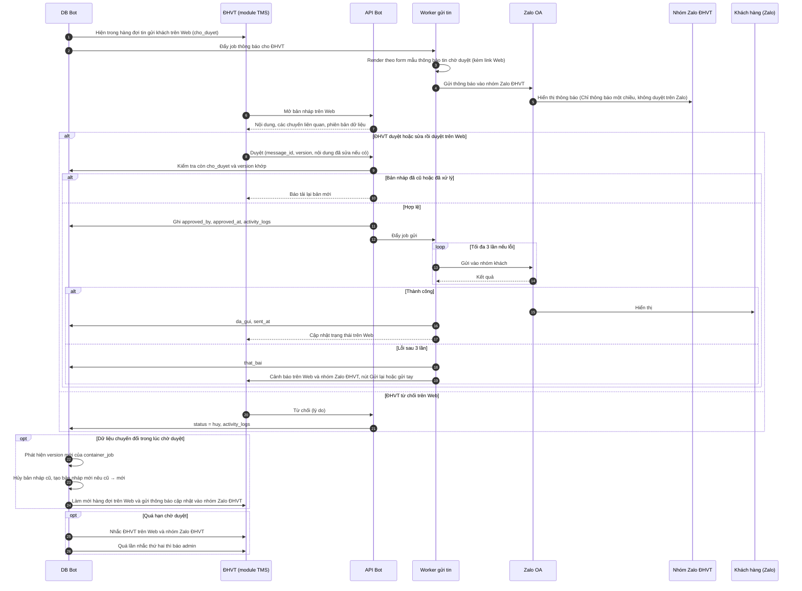
```mermaid
sequenceDiagram
    autonumber
    participant DB as DB Bot
    participant DH as ĐHVT (module TMS)
    participant API as API Bot
    participant W as Worker gửi tin
    participant OA as Zalo OA
    participant GR as Nhóm Zalo ĐHVT
    participant KH as Khách hàng (Zalo)

    DB->>DH: Hiện trong hàng đợi tin gửi khách trên Web (cho_duyet)
    DB->>W: Đẩy job thông báo cho ĐHVT
    W->>W: Render theo form mẫu thông báo tin chờ duyệt (kèm link Web)
    W->>OA: Gửi thông báo vào nhóm Zalo ĐHVT
    OA->>GR: Hiển thị thông báo (Chỉ thông báo một chiều, không duyệt trên Zalo)

    DH->>API: Mở bản nháp trên Web
    API-->>DH: Nội dung, các chuyến liên quan, phiên bản dữ liệu

    alt ĐHVT duyệt hoặc sửa rồi duyệt trên Web
        DH->>API: Duyệt (message_id, version, nội dung đã sửa nếu có)
        API->>DB: Kiểm tra còn cho_duyet và version khớp
        alt Bản nháp đã cũ hoặc đã xử lý
            API-->>DH: Báo tải lại bản mới
        else Hợp lệ
            API->>DB: Ghi approved_by, approved_at, activity_logs
            API->>W: Đẩy job gửi
            loop Tối đa 3 lần nếu lỗi
                W->>OA: Gửi vào nhóm khách
                OA-->>W: Kết quả
            end
            alt Thành công
                OA->>KH: Hiển thị
                W->>DB: da_gui, sent_at
                W-->>DH: Cập nhật trạng thái trên Web
            else Lỗi sau 3 lần
                W->>DB: that_bai
                W->>DH: Cảnh báo trên Web và nhóm Zalo ĐHVT, nút Gửi lại hoặc gửi tay
            end
        end
    else ĐHVT từ chối trên Web
        DH->>API: Từ chối (lý do)
        API->>DB: status = huy, activity_logs
    end

    opt Dữ liệu chuyến đổi trong lúc chờ duyệt
        DB->>DB: Phát hiện version mới của container_job
        DB->>DB: Hủy bản nháp cũ, tạo bản nháp mới nêu cũ → mới
        DB->>DH: Làm mới hàng đợi trên Web và gửi thông báo cập nhật vào nhóm Zalo ĐHVT
    end

    opt Quá hạn chờ duyệt
        DB->>DH: Nhắc ĐHVT trên Web và nhóm Zalo ĐHVT
        DB->>DH: Quá lần nhắc thứ hai thì báo admin
    end
```

#### 2.2c Khách hỏi bot và đề nghị thay đổi

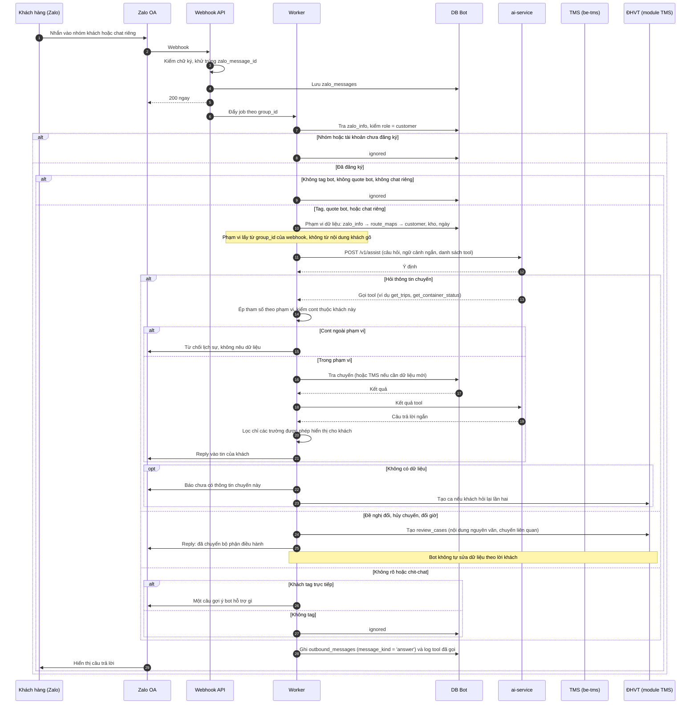
```mermaid
sequenceDiagram
    autonumber
    participant KH as Khách hàng (Zalo)
    participant OA as Zalo OA
    participant WH as Webhook API
    participant W as Worker
    participant DB as DB Bot
    participant AI as ai-service
    participant TMS as TMS (be-tms)
    participant DH as ĐHVT (module TMS)

    KH->>OA: Nhắn vào nhóm khách hoặc chat riêng
    OA->>WH: Webhook
    WH->>WH: Kiểm chữ ký, khử trùng zalo_message_id
    WH->>DB: Lưu zalo_messages
    WH-->>OA: 200 ngay
    WH->>W: Đẩy job theo group_id

    W->>DB: Tra zalo_info, kiểm role = customer
    alt Nhóm hoặc tài khoản chưa đăng ký
        W->>DB: ignored
    else Đã đăng ký
        alt Không tag bot, không quote bot, không chat riêng
            W->>DB: ignored
        else Tag, quote bot, hoặc chat riêng
            W->>DB: Phạm vi dữ liệu: zalo_info → route_maps → customer, kho, ngày
            Note over W: Phạm vi lấy từ group_id của webhook, không từ nội dung khách gõ
            W->>AI: POST /v1/assist (câu hỏi, ngữ cảnh ngắn, danh sách tool)
            AI-->>W: Ý định

            alt Hỏi thông tin chuyến
                AI-->>W: Gọi tool (ví dụ get_trips, get_container_status)
                W->>W: Ép tham số theo phạm vi, kiểm cont thuộc khách này
                alt Cont ngoài phạm vi
                    W->>OA: Từ chối lịch sự, không nêu dữ liệu
                else Trong phạm vi
                    W->>DB: Tra chuyến (hoặc TMS nếu cần dữ liệu mới)
                    DB-->>W: Kết quả
                    W->>AI: Kết quả tool
                    AI-->>W: Câu trả lời ngắn
                    W->>W: Lọc chỉ các trường được phép hiển thị cho khách
                    W->>OA: Reply vào tin của khách
                end
                opt Không có dữ liệu
                    W->>OA: Báo chưa có thông tin chuyến này
                    W->>DH: Tạo ca nếu khách hỏi lại lần hai
                end
            else Đề nghị đổi, hủy chuyến, đổi giờ
                W->>DH: Tạo review_cases (nội dung nguyên văn, chuyến liên quan)
                W->>OA: Reply: đã chuyển bộ phận điều hành
                Note over W,DH: Bot không tự sửa dữ liệu theo lời khách
            else Không rõ hoặc chit-chat
                alt Khách tag trực tiếp
                    W->>OA: Một câu gợi ý bot hỗ trợ gì
                else Không tag
                    W->>DB: ignored
                end
            end

            W->>DB: Ghi outbound_messages (message_kind = 'answer') và log tool đã gọi
            OA->>KH: Hiển thị câu trả lời
        end
    end
```

### 2.3 Bot với ĐHVT

#### 2.3a Tạo ca, đưa lên hàng đợi Web và thông báo vào nhóm Zalo ĐHVT

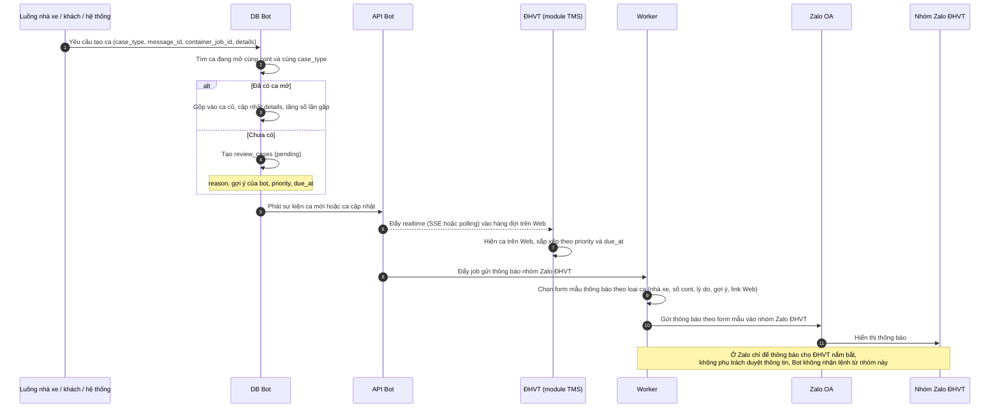
```mermaid
sequenceDiagram
    autonumber
    participant SRC as Luồng nhà xe / khách / hệ thống
    participant DB as DB Bot
    participant API as API Bot
    participant DH as ĐHVT (module TMS)
    participant W as Worker
    participant OA as Zalo OA
    participant GR as Nhóm Zalo ĐHVT

    SRC->>DB: Yêu cầu tạo ca (case_type, message_id, container_job_id, details)
    DB->>DB: Tìm ca đang mở cùng cont và cùng case_type
    alt Đã có ca mở
        DB->>DB: Gộp vào ca cũ, cập nhật details, tăng số lần gặp
    else Chưa có
        DB->>DB: Tạo review_cases (pending)
        Note over DB: reason, gợi ý của bot, priority, due_at
    end

    DB->>API: Phát sự kiện ca mới hoặc ca cập nhật
    API-->>DH: Đẩy realtime (SSE hoặc polling) vào hàng đợi trên Web
    DH->>DH: Hiện ca trên Web, sắp xếp theo priority và due_at

    API->>W: Đẩy job gửi thông báo nhóm Zalo ĐHVT
    W->>W: Chọn form mẫu thông báo theo loại ca (nhà xe, số cont, lý do, gợi ý, link Web)
    W->>OA: Gửi thông báo theo form mẫu vào nhóm Zalo ĐHVT
    OA->>GR: Hiển thị thông báo
    Note over W,GR: Ở Zalo chỉ để thông báo cho ĐHVT nắm bắt,<br/>không phụ trách duyệt thông tin, Bot không nhận lệnh từ nhóm này
```

#### 2.3b ĐHVT xử lý ca

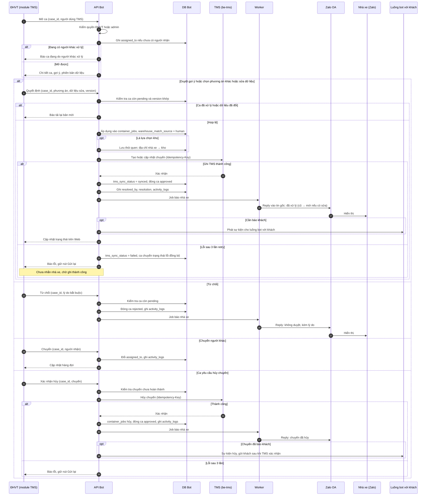
```mermaid
sequenceDiagram
    autonumber
    participant DH as ĐHVT (module TMS)
    participant API as API Bot
    participant DB as DB Bot
    participant TMS as TMS (be-tms)
    participant W as Worker
    participant OA as Zalo OA
    participant NX as Nhà xe (Zalo)
    participant K as Luồng bot với khách

    DH->>API: Mở ca (case_id, người dùng TMS)
    API->>API: Kiểm quyền ĐHVT hoặc admin
    API->>DB: Ghi assigned_to nếu chưa có người nhận
    alt Đang có người khác xử lý
        API-->>DH: Báo ca đang do người khác xử lý
    else Mở được
        API-->>DH: Chi tiết ca, gợi ý, phiên bản dữ liệu
    end

    alt Duyệt gợi ý hoặc chọn phương án khác hoặc sửa dữ liệu
        DH->>API: Quyết định (case_id, phương án, dữ liệu sửa, version)
        API->>DB: Kiểm tra ca còn pending và version khớp
        alt Ca đã xử lý hoặc dữ liệu đã đổi
            API-->>DH: Báo tải lại bản mới
        else Hợp lệ
            API->>DB: Áp dụng vào container_jobs, warehouse_match_source = human
            opt Là lựa chọn kho
                API->>DB: Lưu thói quen: địa chỉ nhà xe → kho
            end
            API->>TMS: Tạo hoặc cập nhật chuyến (Idempotency-Key)
            alt Ghi TMS thành công
                TMS-->>API: Xác nhận
                API->>DB: tms_sync_status = synced, đóng ca approved
                API->>DB: Ghi resolved_by, resolution, activity_logs
                API->>W: Job báo nhà xe
                W->>OA: Reply vào tin gốc: đã xử lý (cũ → mới nếu có sửa)
                OA->>NX: Hiển thị
                opt Cần báo khách
                    API->>K: Phát sự kiện cho luồng bot với khách
                end
                API-->>DH: Cập nhật trạng thái trên Web
            else Lỗi sau 3 lần retry
                API->>DB: tms_sync_status = failed, ca chuyển trạng thái lỗi đồng bộ
                API-->>DH: Báo lỗi, giữ nút Gửi lại
                Note over API,DH: Chưa nhắn nhà xe, chờ ghi thành công
            end
        end

    else Từ chối
        DH->>API: Từ chối (case_id, lý do bắt buộc)
        API->>DB: Kiểm tra ca còn pending
        API->>DB: Đóng ca rejected, ghi activity_logs
        API->>W: Job báo nhà xe
        W->>OA: Reply: không duyệt, kèm lý do
        OA->>NX: Hiển thị

    else Chuyển người khác
        DH->>API: Chuyển (case_id, người nhận)
        API->>DB: Đổi assigned_to, ghi activity_logs
        API-->>DH: Cập nhật hàng đợi

    else Ca yêu cầu hủy chuyến
        DH->>API: Xác nhận hủy (case_id, chuyến)
        API->>DB: Kiểm tra chuyến chưa hoàn thành
        API->>TMS: Hủy chuyến (Idempotency-Key)
        alt Thành công
            TMS-->>API: Xác nhận
            API->>DB: container_jobs hủy, đóng ca approved, ghi activity_logs
            API->>W: Job báo nhà xe
            W->>OA: Reply: chuyến đã hủy
            opt Chuyến đã báo khách
                API->>K: Sự kiện hủy, gửi khách sau khi TMS xác nhận
            end
        else Lỗi sau 3 lần
            API-->>DH: Báo lỗi, giữ nút Gửi lại
        end
    end
```

#### 2.3c Cảnh báo hệ thống và leo thang

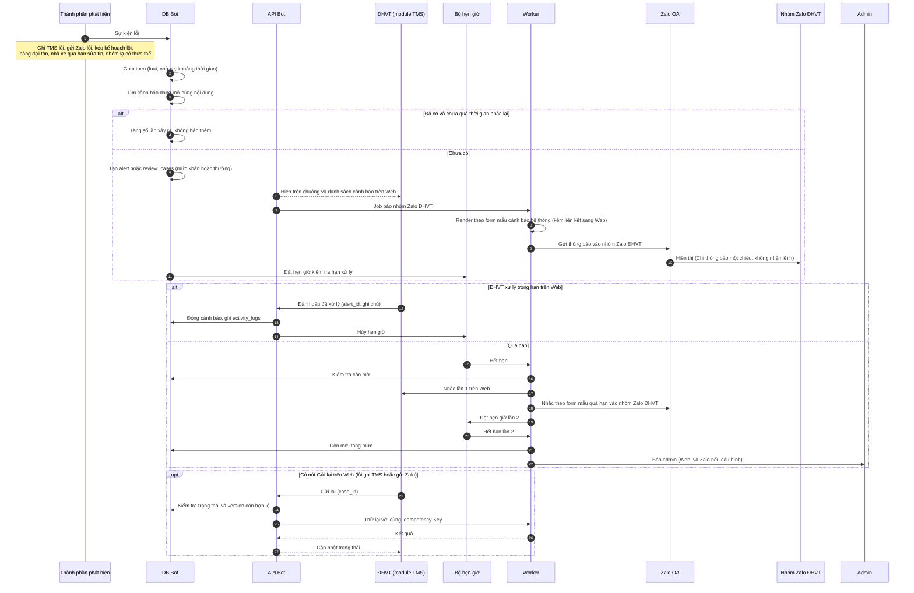
```mermaid
sequenceDiagram
    autonumber
    participant SRC as Thành phần phát hiện
    participant DB as DB Bot
    participant API as API Bot
    participant DH as ĐHVT (module TMS)
    participant T as Bộ hẹn giờ
    participant W as Worker
    participant OA as Zalo OA
    participant GR as Nhóm Zalo ĐHVT
    participant AD as Admin

    SRC->>DB: Sự kiện lỗi
    Note over SRC: Ghi TMS lỗi, gửi Zalo lỗi, kéo kế hoạch lỗi,<br/>hàng đợi tồn, nhà xe quá hạn sửa tin, nhóm lạ có thực thể
    DB->>DB: Gom theo (loại, nhà xe, khoảng thời gian)
    DB->>DB: Tìm cảnh báo đang mở cùng nội dung
    alt Đã có và chưa quá thời gian nhắc lại
        DB->>DB: Tăng số lần xảy ra, không báo thêm
    else Chưa có
        DB->>DB: Tạo alert hoặc review_cases (mức khẩn hoặc thường)
        API-->>DH: Hiện trên chuông và danh sách cảnh báo trên Web
        API->>W: Job báo nhóm Zalo ĐHVT
        W->>W: Render theo form mẫu cảnh báo hệ thống (kèm liên kết sang Web)
        W->>OA: Gửi thông báo vào nhóm Zalo ĐHVT
        OA->>GR: Hiển thị (Chỉ thông báo một chiều, không nhận lệnh)
        DB->>T: Đặt hẹn giờ kiểm tra hạn xử lý
    end

    alt ĐHVT xử lý trong hạn trên Web
        DH->>API: Đánh dấu đã xử lý (alert_id, ghi chú)
        API->>DB: Đóng cảnh báo, ghi activity_logs
        API->>T: Hủy hẹn giờ
    else Quá hạn
        T->>W: Hết hạn
        W->>DB: Kiểm tra còn mở
        W->>DH: Nhắc lần 1 trên Web
        W->>OA: Nhắc theo form mẫu quá hạn vào nhóm Zalo ĐHVT
        W->>T: Đặt hẹn giờ lần 2
        T->>W: Hết hạn lần 2
        W->>DB: Còn mở, tăng mức
        W->>AD: Báo admin (Web, và Zalo nếu cấu hình)
    end

    opt Có nút Gửi lại trên Web (lỗi ghi TMS hoặc gửi Zalo)
        DH->>API: Gửi lại (case_id)
        API->>DB: Kiểm tra trạng thái và version còn hợp lệ
        API->>W: Thử lại với cùng Idempotency-Key
        W-->>API: Kết quả
        API-->>DH: Cập nhật trạng thái
    end
```

#### 2.3d ĐHVT hỏi thông tin, Bot trả lời (Tra cứu nội bộ)

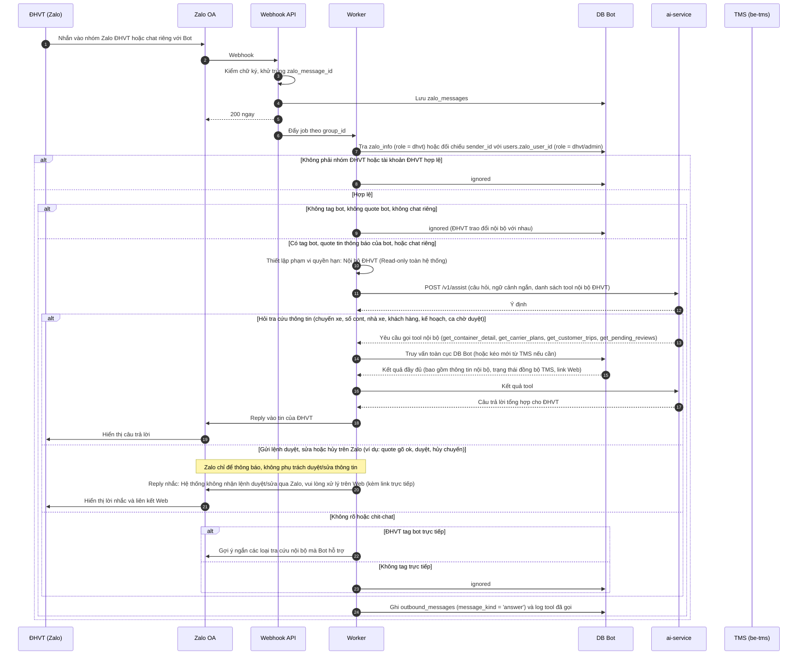
```mermaid
sequenceDiagram
    autonumber
    participant DHZ as ĐHVT (Zalo)
    participant OA as Zalo OA
    participant WH as Webhook API
    participant W as Worker
    participant DB as DB Bot
    participant AI as ai-service
    participant TMS as TMS (be-tms)

    DHZ->>OA: Nhắn vào nhóm Zalo ĐHVT hoặc chat riêng với Bot
    OA->>WH: Webhook
    WH->>WH: Kiểm chữ ký, khử trùng zalo_message_id
    WH->>DB: Lưu zalo_messages
    WH-->>OA: 200 ngay
    WH->>W: Đẩy job theo group_id

    W->>DB: Tra zalo_info (role = dhvt) hoặc đối chiếu sender_id với users.zalo_user_id (role = dhvt/admin)
    alt Không phải nhóm ĐHVT hoặc tài khoản ĐHVT hợp lệ
        W->>DB: ignored
    else Hợp lệ
        alt Không tag bot, không quote bot, không chat riêng
            W->>DB: ignored (ĐHVT trao đổi nội bộ với nhau)
        else Có tag bot, quote tin thông báo của bot, hoặc chat riêng
            W->>W: Thiết lập phạm vi quyền hạn: Nội bộ ĐHVT (Read-only toàn hệ thống)
            W->>AI: POST /v1/assist (câu hỏi, ngữ cảnh ngắn, danh sách tool nội bộ ĐHVT)
            AI-->>W: Ý định

            alt Hỏi tra cứu thông tin (chuyến xe, số cont, nhà xe, khách hàng, kế hoạch, ca chờ duyệt)
                AI-->>W: Yêu cầu gọi tool nội bộ (get_container_detail, get_carrier_plans, get_customer_trips, get_pending_reviews)
                W->>DB: Truy vấn toàn cục DB Bot (hoặc kéo mới từ TMS nếu cần)
                DB-->>W: Kết quả đầy đủ (bao gồm thông tin nội bộ, trạng thái đồng bộ TMS, link Web)
                W->>AI: Kết quả tool
                AI-->>W: Câu trả lời tổng hợp cho ĐHVT
                W->>OA: Reply vào tin của ĐHVT
                OA->>DHZ: Hiển thị câu trả lời
            else Gửi lệnh duyệt, sửa hoặc hủy trên Zalo (ví dụ: quote gõ ok, duyệt, hủy chuyến)
                Note over W,OA: Zalo chỉ để thông báo, không phụ trách duyệt/sửa thông tin
                W->>OA: Reply nhắc: Hệ thống không nhận lệnh duyệt/sửa qua Zalo, vui lòng xử lý trên Web (kèm link trực tiếp)
                OA->>DHZ: Hiển thị lời nhắc và liên kết Web
            else Không rõ hoặc chit-chat
                alt ĐHVT tag bot trực tiếp
                    W->>OA: Gợi ý ngắn các loại tra cứu nội bộ mà Bot hỗ trợ
                else Không tag trực tiếp
                    W->>DB: ignored
                end
            end

            W->>DB: Ghi outbound_messages (message_kind = 'answer') và log tool đã gọi
        end
    end
```

# III. Kiến trúc bảo mật và phân quyền

## 1. Mô hình phân quyền tổng thể (RBAC & Phân định phạm vi)

### 1.1 Sơ đồ kiến trúc bảo mật đa tầng

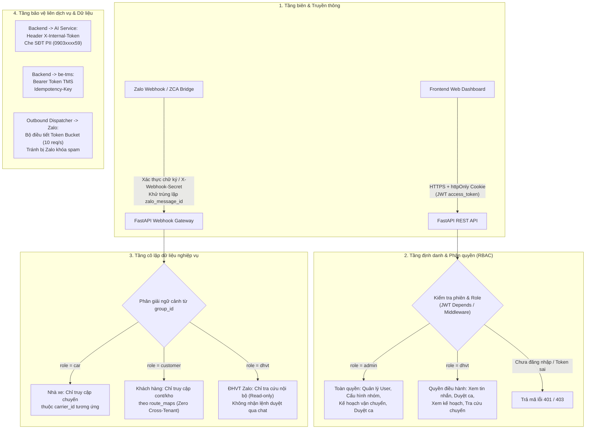
```mermaid
flowchart TD
    subgraph INGRESS ["1. Tầng biên & Truyền thông"]
        Z_WH["Zalo Webhook / ZCA Bridge"] -->|"Xác thực chữ ký / X-Webhook-Secret<br/>Khử trùng lặp zalo_message_id"| API_GW["FastAPI Webhook Gateway"]
        WEB_FE["Frontend Web Dashboard"] -->|"HTTPS + httpOnly Cookie<br/>(JWT access_token)"| API_REST["FastAPI REST API"]
    end

    subgraph AUTH_LAYER ["2. Tầng định danh & Phân quyền (RBAC)"]
        API_REST --> MW_AUTH{"Kiểm tra phiên & Role<br/>(JWT Depends / Middleware)"}
        MW_AUTH -- "role = admin" --> PERM_ADMIN["Toàn quyền: Quản lý User, Cấu hình nhóm,<br/>Kế hoạch vận chuyển, Duyệt ca"]
        MW_AUTH -- "role = dhvt" --> PERM_DHVT["Quyền điều hành: Xem tin nhắn, Duyệt ca,<br/>Xem kế hoạch, Tra cứu chuyến"]
        MW_AUTH -- "Chưa đăng nhập / Token sai" --> ERR_401["Trả mã lỗi 401 / 403"]
    end

    subgraph DOMAIN_ISOLATION ["3. Tầng cô lập dữ liệu nghiệp vụ"]
        API_GW --> CHK_SCOPE{"Phân giải ngữ cảnh từ group_id"}
        CHK_SCOPE -- "role = car" --> SCOPE_CAR["Nhà xe: Chỉ truy cập chuyến<br/>thuộc carrier_id tương ứng"]
        CHK_SCOPE -- "role = customer" --> SCOPE_CUST["Khách hàng: Chỉ truy cập cont/kho<br/>theo route_maps (Zero Cross-Tenant)"]
        CHK_SCOPE -- "role = dhvt" --> SCOPE_DHVT["ĐHVT Zalo: Chỉ tra cứu nội bộ (Read-only)<br/>Không nhận lệnh duyệt qua chat"]
    end

    subgraph INTERNAL_SEC ["4. Tầng bảo vệ liên dịch vụ & Dữ liệu"]
        SEC_AI["Backend -> AI Service:<br/>Header X-Internal-Token<br/>Che SĐT PII (0903xxxx59)"]
        SEC_TMS["Backend -> be-tms:<br/>Bearer Token TMS<br/>Idempotency-Key"]
        SEC_ZALO["Outbound Dispatcher -> Zalo:<br/>Bộ điều tiết Token Bucket (10 req/s)<br/>Tránh bị Zalo khóa spam"]
    end
```

### 1.2 Ma trận phân quyền theo đối tượng (RBAC Matrix)

| Đối tượng | Kênh tương tác | Cơ chế định danh | Quyền hạn đối với hệ thống | Giới hạn và Ràng buộc an toàn |
| :-- | :-- | :-- | :-- | :-- |
| **Nhà xe** | Nhóm Zalo `role = car` | `zalo_info.carrier_id` liên kết `carriers.id` | Báo xe mới, bổ sung thông tin, sửa xe, đề nghị hủy chuyến; tra cứu tiến độ chuyến xe của chính nhà xe mình | Chỉ truy cập dữ liệu chuyến thuộc `carrier_id` của nhóm. Hủy chuyến hoặc đổi xe sau khi đã gửi khách luôn chuyển thành ca chờ ĐHVT xác nhận trên Web |
| **Khách hàng** | Nhóm Zalo hoặc chat riêng `role = customer` | `zalo_info` kết hợp ma trận `route_maps` | Chỉ đọc: tra cứu thông tin chuyến xe, số container, số chì, giờ dự kiến đến kho của lô hàng mình | Chỉ hiển thị dữ liệu thuộc khách hàng và kho được cấu hình trong `route_maps`. Đề nghị đổi/hủy của khách chỉ ghi nhận thành ca chờ cho ĐHVT, Bot không tự ý sửa đổi dữ liệu |
| **Điều hành vận tải (ĐHVT)** | Web quản lý (Dashboard) | Bảng `users` (`role = dhvt`), phiên xác thực qua `httpOnly` cookie | Xem danh sách tin nhắn, bóc tách thực thể, quản lý kế hoạch vận chuyển, duyệt/sửa/từ chối ca chờ duyệt, phát hành thông báo gửi khách, kích hoạt gửi lại khi lỗi | Thao tác duyệt và chỉnh sửa dữ liệu bắt buộc thực hiện trên Web quản lý; không nhận lệnh duyệt qua tin nhắn Zalo |
| **Điều hành vận tải (ĐHVT)** | Nhóm Zalo ĐHVT nội bộ, chat riêng | `zalo_info.role = dhvt` hoặc `users.zalo_user_id` khớp `zalo_messages.sender_id` | Nhận thông báo nghiệp vụ một chiều từ Bot; hỏi tra cứu dữ liệu nội bộ (chỉ đọc) qua ngôn ngữ tự nhiên | Bot không nhận lệnh duyệt, sửa, hủy qua chat Zalo; khi phát hiện lệnh duyệt trên Zalo, Bot gửi phản hồi nhắc nhở kèm liên kết dẫn tới ca xử lý trên Web |
| **Quản trị viên (Admin)** | Web quản lý (Dashboard) | Bảng `users` (`role = admin`), phiên xác thực qua `httpOnly` cookie | Toàn quyền của ĐHVT, quản lý danh mục tài khoản người dùng, cấu hình chế độ gửi của nhóm Zalo (`send_mode`), tiếp nhận cảnh báo leo thang khi ca quá hạn lần hai | Riêng màn hình quản lý người dùng (`/admin/users`) và phân quyền hệ thống chỉ dành cho vai trò Admin |

## 2. Nguyên tắc bảo mật hệ thống

### 2.1 Xác thực đầu vào từ Zalo và Chống tấn công Replay
- Mọi sự kiện Webhook từ Zalo OA hoặc cầu nối `zca-js` gửi tới `POST /webhook` bắt buộc phải được kiểm tra chữ ký bí mật trong HTTP Header (`X-Webhook-Secret` khớp với `ZALO_SECRET_KEY` trong `.env`). Nếu không khớp, từ chối ngay với mã lỗi `401 Unauthorized`.
- Khử trùng lặp tuyệt đối (Idempotency) dựa trên `zalo_messages.zalo_message_id`: Khi máy chủ Zalo gửi lại sự kiện do timeout mạng, hệ thống phát hiện trùng lặp, bỏ qua không đẩy vào hàng đợi xử lý để ngăn chặn việc nhân bản dữ liệu.
- Nhóm Zalo hoặc tài khoản gửi tin chưa đăng ký trong `zalo_info` bị đánh dấu `ignored`; trường hợp nội dung tin chứa thực thể vận tải (biển số, số cont), hệ thống tự động tạo ca `group_mismatch` cho ĐHVT xác minh, tuyệt đối không tự xử lý dữ liệu từ nguồn lạ.

### 2.2 Cô lập dữ liệu giữa các đối tác (Multi-tenant Data Isolation)
- Phạm vi dữ liệu (Scope) của mọi truy vấn luôn được xác định từ `group_id` của Webhook (thông qua bảng `zalo_info`, `carrier_id`, `route_maps`), tuyệt đối không dựa vào chuỗi văn bản do người dùng tự nhập trong tin nhắn.
- Mô hình ngôn ngữ (LLM) chỉ đề xuất tên công cụ tra cứu và tham số trích xuất; tầng Worker của Backend kiểm tra quyền hạn, ép chặt tham số truy vấn theo phạm vi đối tác đã xác định trước khi thực thi truy vấn cơ sở dữ liệu.
- Đối với khách hàng, thông điệp phản hồi khi không tìm thấy container và khi container nằm ngoài phạm vi phân quyền sử dụng cùng một nội dung thông báo chung, nhằm bảo mật tuyệt đối thông tin, không để lộ việc container đang phục vụ khách hàng khác. Hai trường hợp này được ghi nhận mã riêng trong log kiểm toán nội bộ.
- Chỉ hiển thị cho khách hàng các trường thông tin được phép (biển số, tài xế, cont, chì, giờ đến, điểm trả); toàn bộ thông tin nhạy cảm nội bộ (trạng thái đồng bộ TMS, lịch sử ca duyệt, ghi chú điều hành) bị ẩn hoàn toàn.

### 2.3 Giao tiếp nội bộ giữa các dịch vụ (Microservices Security)
- Backend gọi sang `ai-service` bắt buộc gửi kèm header xác thực nội bộ `X-Internal-Token` (khớp với `INTERNAL_SECRET`); dịch vụ `ai-service` chạy trong mạng nội bộ, không mở cổng ra Internet công cộng và không nhận lưu lượng trực tiếp từ Frontend.
- Backend giao tiếp với hệ thống phần mềm lõi `be-tms` qua client chuyên dụng, gửi Bearer Token định danh Trưởng phòng Forwarder và đính kèm `Idempotency-Key` cho mọi thao tác ghi (tạo mới, cập nhật, hủy chuyến xe) để tránh tạo trùng chuyến khi mạng chập chờn.
- Frontend Web chỉ giao tiếp duy nhất với REST API của Backend (`NEXT_PUBLIC_API_URL`); không bao giờ gọi trực tiếp tới `ai-service`, `zca-js`, cơ sở dữ liệu MySQL, MinIO hay API `be-tms`.

### 2.4 Bảo vệ dữ liệu cá nhân (PII Protection)
- Số điện thoại của lái xe được tự động che giấu (mã hóa một phần dạng `0903xxxx59` hoặc `0903******`) trước khi gửi văn bản lên các mô hình LLM đám mây và được khôi phục sau khi nhận kết quả bóc tách.
- Tuyệt đối không ghi thông tin nhạy cảm (mật khẩu, token, SĐT đầy đủ) vào log ứng dụng; bảng `extraction_runs` chỉ ghi nhận `model_name`, `prompt_version`, độ trễ và số lượng bản ghi bóc tách.
- Tệp đính kèm và hình ảnh phiếu điều xe được lưu trữ tập trung tại MinIO S3; cơ sở dữ liệu bảng `files` chỉ quản lý `bucket`, `object_key` và mã băm `sha256`. Khi người dùng xem ảnh trên Web, hệ thống sinh đường dẫn Presigned URL có thời hạn ngắn (15 đến 30 phút).
- Tuyệt đối không đưa khóa bí mật, API key, mật khẩu cơ sở dữ liệu hay phiên đăng nhập Zalo vào mã nguồn hoặc kho lưu trữ Git; toàn bộ được nạp từ tệp biến môi trường `.env` duy nhất tại thư mục gốc.

### 2.5 Xác thực phiên làm việc trên Web Dashboard (Secure Cookie & Stateless RBAC)
- Phiên đăng nhập trên Web quản trị sử dụng JWT (JSON Web Token) lưu trữ trong **`httpOnly` cookie** với các cờ bảo mật bắt buộc: `HttpOnly` (ngăn chặn tấn công XSS đánh cắp token), `Secure` (chỉ truyền tải qua kết nối HTTPS bảo mật), và `SameSite=Lax` (ngăn chặn tấn công CSRF). Không lưu trữ token trong `localStorage` hoặc `sessionStorage`.
- Tầng Middleware của Next.js kiểm tra phiên đăng nhập và vai trò (`role`) trước khi cho phép render giao diện. Đồng thời, Backend FastAPI kiểm tra lại tính hợp lệ của token và quyền hạn (`role = 'admin'` hoặc `role = 'dhvt'`) độc lập tại từng endpoint REST API thông qua FastAPI Dependency Injection (`Depends(get_current_user)`).
- Thao tác duyệt ca, chỉnh sửa hoặc từ chối bắt buộc phải thỏa mãn đồng thời 3 điều kiện: ca duyệt đang ở trạng thái `pending`, phiên bản dữ liệu chưa bị thay đổi kể từ lúc mở ca (đối soát trường `version` để chống ghi đè do chạy đua phiên làm việc), và tài khoản thực hiện có trạng thái `is_active = True`.

### 2.6 Cơ chế Chống ghi đè và Chống gửi trùng lặp
- Khóa chống gửi trùng thông báo cho khách hàng: Ràng buộc duy nhất `UNIQUE(container_job_id, job_version, message_kind)` tại bảng `outbound_message_items`. Khi 2 tiến trình worker cùng xử lý một chuyến xe, tiến trình thứ hai sẽ vi phạm ràng buộc và tự động dừng lại, đảm bảo mỗi phiên bản chỉ được phát hành đúng một lần.
- Khóa chống thao tác trùng trên TMS: Sử dụng `Idempotency-Key` gắn liền với mã chuyến xe và phiên bản cập nhật; khóa này được tái sử dụng khi nhân viên bấm "Gửi lại" sau sự cố mạng.
- Khi một điều hành viên mở một ca duyệt trên Web, hệ thống ghi nhận `assigned_to` để hiển thị trạng thái đang xử lý cho các điều hành viên khác, tránh việc hai người cùng can thiệp một ca.

### 2.7 Kiểm toán vận hành và Điều tiết tần suất gửi tin (Rate Limiting)
- Mọi thao tác nghiệp vụ của người dùng và các tiến trình tự động nền đều được ghi vết đầy đủ vào bảng `activity_logs` (ghi rõ `user_id`, thời điểm, hành động và thay đổi dữ liệu; trường `user_id` để trống khi do worker tự động thực thi).
- Mọi lượt gọi tích hợp tới TMS được ghi vết chi tiết tại `tms_sync_logs`, bao gồm dữ liệu gửi, phản hồi và số lần thử lại (Retry).
- Tin nhắn gửi ra nền tảng Zalo được kiểm soát qua bộ điều tiết tần suất **Token Bucket** (`ZaloOutboundThrottler`) với giới hạn 10 request/giây và bộ đệm tức thời 20 tokens, kết hợp thuật toán lùi thời gian theo hàm mũ (Exponential Backoff) khi nhận mã lỗi `HTTP 429` để bảo vệ tài khoản không bị Zalo khóa do nghi vấn spam. Nếu gửi thất bại 3 lần liên tiếp, hệ thống tự động chuyển trạng thái tin sang lỗi và sinh cảnh báo cho ĐHVT xử lý thủ công.

## 3. Việc cần chốt thêm

| Nội dung | Trạng thái |
| :-- | :-- |
| Danh sách chính xác các trường được phép hiển thị cho khách hàng | Chưa chốt |
| Thời gian lưu `raw_payload` và file ảnh trước khi xóa mềm | Chưa chốt |
| Cách xác thực chữ ký webhook khi chuyển từ Zalo OA sang cầu nối `zca-js` | Chưa chốt |
| Chính sách khóa tài khoản và hết hạn phiên đăng nhập Web | Chưa chốt |
